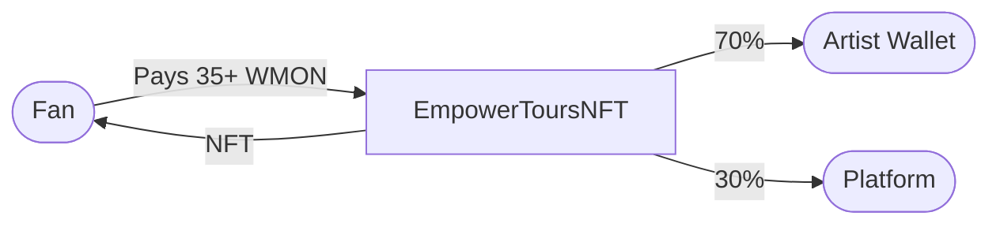
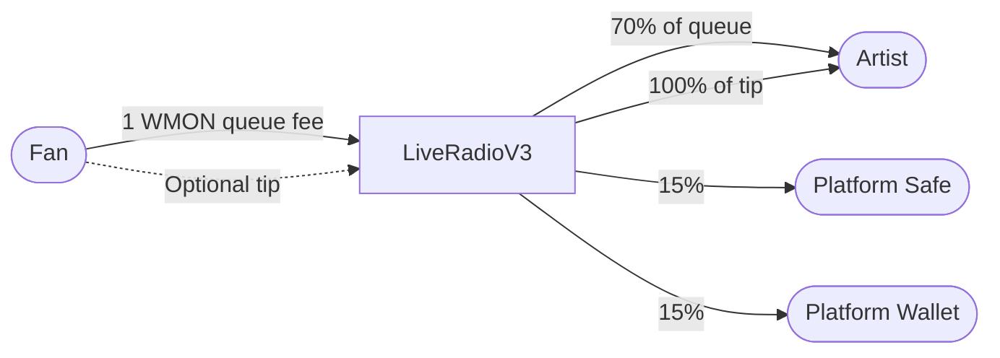
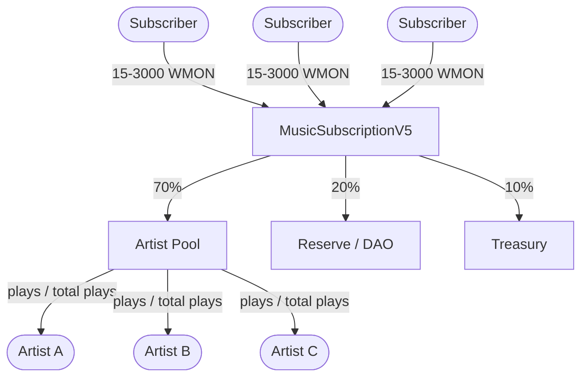
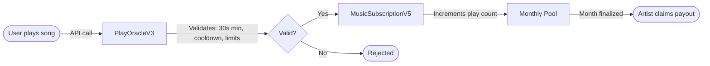
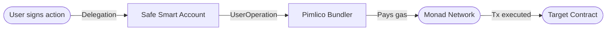
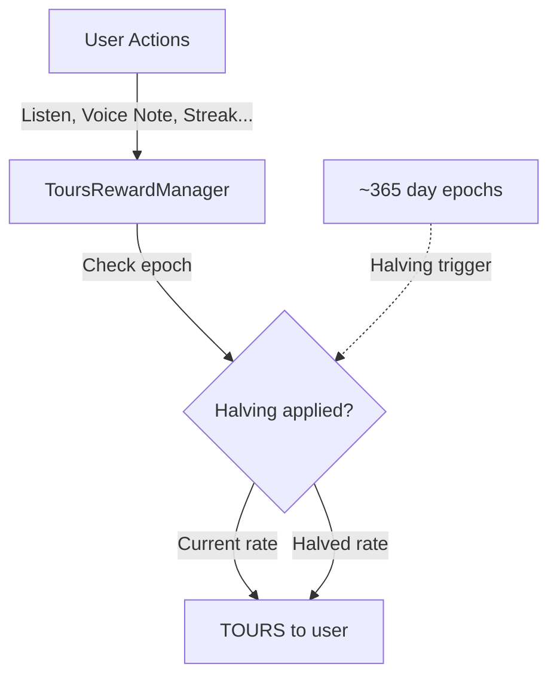

# EmpowerTours - Farcaster Mini App

> **Travel Passports, Music Streaming, Live Radio, Rock Climbing, DAO Governance, and Social Experiences on Monad**

[](https://monad.xyz)
[](https://docs.farcaster.xyz)
[](https://nextjs.org)

**Live App:** [https://fcempowertours-production-6551.up.railway.app](https://fcempowertours-production-6551.up.railway.app)
**Farcaster:** [https://farcaster.xyz/miniapps/83hgtZau7TNB/empowertours](https://farcaster.xyz/miniapps/83hgtZau7TNB/empowertours)

---

## What is EmpowerTours?

EmpowerTours is a comprehensive Web3 platform built as a **Farcaster Mini App** on Monad. It combines travel passport NFTs, music streaming with NFT-based licensing, live community radio, rock climbing adventures, DAO governance, event sponsorship, AI-powered interactions, and fully gasless transactions through Account Abstraction.

---

## Table of Contents

- [Features](#features)
- [Economics & Payouts](#economics--payouts)
- [Architecture Diagrams](#architecture-diagrams)
- [Deployed Contracts (V3)](#deployed-contracts-v3)
- [Tech Stack](#tech-stack)
- [Project Structure](#project-structure)
- [Getting Started](#getting-started)
- [Deployment](#deployment)
- [Links](#links)

---

## Features

### Travel Passport NFTs (195 Countries)

Mint digital passports with automatic geolocation detection. One per country per wallet, fully gasless.

1. User opens app and connects wallet
2. Geolocation detects country automatically
3. Mint creates on-chain SVG passport NFT (gasless via Safe + Pimlico)
4. Cast automatically posts to Farcaster with country flag

### Music NFT Licensing

Artists mint master NFTs they own forever. Fans buy renewable time-limited licenses to access full tracks. Four NFT types are available:

| Type | Description | Extras |
|------|-------------|--------|
| **Music NFT** | Standard music NFT with cover art + audio | — |
| **Collector Edition Music NFT** | Premium limited-run music NFT (1–1,000 editions) | AI-enhanced collector cover art via Gemini, 5 WMON creation fee |
| **Art NFT** | Visual art NFT (cover art only, no audio) | — |
| **Collector Edition Art NFT** | Limited-run art NFT (1-of-1 to 1,000 editions) | Artist's original art, no AI, no extra fees |

**Collector editions** use `mintCollectorMaster()` on-chain and support two-tier pricing: a standard license price (min 35 WMON, unlimited) and a collector edition price (min 500 WMON, limited editions).

**Artist Flow:** Upload preview (30s) + full track + cover art, set license price in WMON, mint Master NFT (gasless), earn TOURS rewards from streaming plays.

**Fan Flow:** Browse and preview tracks, buy license with WMON, stream full tracks with on-chain play tracking.

### Music Streaming & Play Tracking

On-chain play recording with artist royalty distribution via PlayOracleV3 contract. Streaming plays earn TOURS rewards for both artists and listeners.

### Live Radio

Community radio station with on-chain listener tracking via LiveRadioV3 contract.

- **Queue Songs** - Pay WMON to add licensed tracks to the live radio queue
- **Voice Shoutouts** - Record and broadcast 3-5 second voice notes (WMON)
- **Skip to Random** - Pay 1 WMON to skip the current song and play a new random track
- **Tip Artists** - 100% of tips go directly to the artist
- **Listener Rewards** - Earn TOURS tokens for tuning in

### Rock Climbing Adventures (ClimbingLocationsV2)

Web3-powered rock climbing community with dual NFT system.

- **Create Locations** - Build climbing routes with GPS coordinates, photos, and descriptions (35 WMON)
- **Purchase Access Badges** - Buy access to climbing locations at creator-set WMON prices (AccessBadge NFT)
- **Journal Climbs** - Log ascents with photos and earn 1-10 TOURS rewards (ClimbProof NFT via Pyth Entropy)
- **Cross-Platform** - Works in both Farcaster Mini App and Telegram Bot

### DAO Governance

Decentralized governance for platform decisions and content moderation.

- **TOURS to vTOURS** - Wrap TOURS tokens into voting-enabled vTOURS
- **Delegation** - Delegate voting power to yourself or other community members
- **Proposals** - Create and vote on governance proposals (100 vTOURS threshold)
- **Content Moderation** - DAO members vote to burn stolen/infringing NFTs
- **Parameters** - 1 day voting delay, 1 week voting period, 4% quorum, 2 day timelock

### Event Sponsorship

Create and sponsor community events with on-chain accountability.

- **Create Events** - Host events with check-in codes and invite links
- **Sponsorship** - Brands sponsor events with WMON escrow
- **Verification Voting** - Checked-in attendees vote on whether sponsor was mentioned
- **Auto-Settlement** - Funds released to host or refunded to sponsor based on vote outcome

### Experiences & Itineraries

- **Experiences** - Create and purchase location-based experiences as NFTs
- **Itinerary NFTs** - AI-generated travel itineraries minted on-chain
- **Itinerary Market** - Browse and purchase community itineraries

### AI Oracle

Natural language interface powered by Google Gemini for blockchain interactions. Chat with the oracle to mint passports, check balances, explore music, and interact with all platform features.

### Delegation System (Gasless Transactions)

User-grants-permission model allowing gasless transactions for 24 hours (max 100 transactions) via Safe Smart Accounts + Pimlico bundler. All platform actions are gasless for delegated users.

---

## Economics & Payouts

Every payment on EmpowerTours is handled by verified smart contracts on Monad. All splits are enforced on-chain — no manual payouts, no minimums, no delays.

### 1. Music License Purchase

**Contract**: `EmpowerToursNFT` — [`0xB9B3acf33439360B55d12429301E946f34f3B73F`](https://monadscan.com/address/0xB9B3acf33439360B55d12429301E946f34f3B73F)

**Standard License:**

| Detail | Value |
|--------|-------|
| Minimum price | 35 WMON |
| Artist share | **70%** |
| Platform share | **30%** |

**Collector Edition (Limited Run):**

| Detail | Value |
|--------|-------|
| Minimum collector price | 500 WMON |
| Max editions | 1–1,000 |
| Artist share | **70%** |
| Platform share | **30%** |
| Creation fee (music collectors) | 5 WMON (covers AI art generation) |
| Creation fee (art collectors) | Free |

**Worked example (standard):**
> Fan buys a music license at 35 WMON.
> - Artist receives **24.5 WMON** (70%)
> - Platform receives **10.5 WMON** (30%)
>
> Artist wallet is credited instantly in the same transaction.

**Worked example (collector edition):**
> Artist creates a collector edition with 100 editions at 500 WMON each.
> - Fan buys collector edition for 500 WMON
> - Artist receives **350 WMON** (70%)
> - Platform receives **150 WMON** (30%)
>
> Music collector editions include AI-enhanced cover art (golden borders, holographic textures, limited edition badge). Art collector editions use the artist's original art with no modifications.

---

### 2. Radio Queue & Tips

**Contract**: `LiveRadioV3` — [`0x042EDF80713e6822a891e4e8a0800c332B8200fd`](https://monadscan.com/address/0x042EDF80713e6822a891e4e8a0800c332B8200fd)

| Detail | Value |
|--------|-------|
| Queue fee | 1 WMON per song |
| Artist share (queue) | **70%** (0.70 WMON) |
| Platform safe | **15%** (0.15 WMON) |
| Platform wallet | **15%** (0.15 WMON) |
| Tips | **100% to artist** |
| Voice note shoutout | 0.5–2 WMON |

**Worked example:**
> Fan queues a song for 1 WMON and adds a 0.5 WMON tip.
> - Queue split: Artist gets **0.70 WMON**, platform safe gets **0.15 WMON**, platform wallet gets **0.15 WMON**
> - Tip: Artist gets **0.50 WMON** (100%)
> - **Artist total: 1.20 WMON**

License holders can queue for free. Random song selection uses Pyth Entropy.

---

### 3. Monthly Subscription Pool

**Contract**: `MusicSubscriptionV5` — [`0x5372aD0291a69c1EBc0BE2dc6DE9dab224045f19`](https://monadscan.com/address/0x5372aD0291a69c1EBc0BE2dc6DE9dab224045f19)

**Subscription Tiers:**

| Tier | Price (WMON) |
|------|-------------|
| Daily | 15 |
| Weekly | 75 |
| Monthly | 300 |
| Yearly | 3,000 |

**Revenue Split:**

| Destination | Share |
|-------------|-------|
| Artist Pool | **70%** |
| Reserve (DAO) | **20%** |
| Treasury | **10%** |

**How artist payouts work:**

Each artist's share of the pool is proportional to their plays that month:

```
Artist payout = (artist's plays / total plays) × artist pool amount
```

**Worked example:**
> Monthly subscription revenue = 10,000 WMON
> - Artist pool = **7,000 WMON** (70%)
> - Reserve (DAO) = 2,000 WMON (20%)
> - Treasury = 1,000 WMON (10%)
>
> If an artist had 500 plays out of 5,000 total plays (10%):
> - Artist earns **700 WMON** (10% of 7,000)
>
> Artists can claim anytime after the month is finalized. **No minimum withdrawal.**

---

### 4. Play Tracking (Oracle)

**Contract**: `PlayOracleV3` — [`0xe210b31bBDf8B28B28c07D45E9b4FC886aafDCEf`](https://monadscan.com/address/0xe210b31bBDf8B28B28c07D45E9b4FC886aafDCEf)

Every music play is recorded on-chain through the Play Oracle, which feeds into the subscription pool for revenue distribution.

**Anti-spam rules:**

| Rule | Limit |
|------|-------|
| Minimum play duration | 30 seconds |
| Replay cooldown (same song) | 5 minutes |
| Max plays per user per day | 500 |
| Max plays per song per user per day | 100 |

Plays are validated by the oracle before being counted toward an artist's monthly pool share.

---

### 5. Itinerary Purchase

**Contract**: `ItineraryNFTV2` — [`0x97529316356A5bcAd81D85E9a0eF941958c4b020`](https://monadscan.com/address/0x97529316356A5bcAd81D85E9a0eF941958c4b020)

| Detail | Value |
|--------|-------|
| Price | Set by creator |
| Creator share | **70%** |
| Platform share | **30%** |

**Worked example:**
> Creator prices an itinerary at 50 WMON.
> - Creator receives **35 WMON** (70%)
> - Platform receives **15 WMON** (30%)

Itinerary buyers can track GPS-verified journeys with photo proof checkpoints.

---

### 6. Climbing Locations

**Contract**: `ClimbingLocationsV2` — [`0x23e45acc278B5c9D1ECc374b39b7d313E781CBc3`](https://monadscan.com/address/0x23e45acc278B5c9D1ECc374b39b7d313E781CBc3)

| Action | Cost | Split |
|--------|------|-------|
| Create location | 35 WMON | — |
| Access badge | Creator-set price | **70% creator / 30% platform** |
| Climb proof journal | Free (earns TOURS) | — |

Climbing locations use a dual-NFT system:
- **Access Badge NFTs** (token IDs 1–999,999) — minted on location purchase
- **Climb Proof NFTs** (token IDs 1,000,000+) — minted on journal submission with photo proof

Journal entries earn TOURS rewards with a random 1–10x multiplier.

---

### 7. TOURS Rewards

**Contract**: `ToursRewardManager` — [`0x7fff35BB27307806B92Fb1D1FBe52D168093eF87`](https://monadscan.com/address/0x7fff35BB27307806B92Fb1D1FBe52D168093eF87)

TOURS is the platform reward token with a **Bitcoin-style halving** schedule.

**Listener / Fan Rewards:**

| Action | TOURS Earned |
|--------|-------------|
| Listen to a song | 0.1 |
| First listen of the day | 5 |
| Submit a voice note | 1 |
| 7-day listening streak | 10 |
| Complete an itinerary | 50 |

**Artist Rewards:**

| Action | TOURS Earned | Requirements |
|--------|-------------|--------------|
| Monthly artist reward | 1 | ≥10 Masters uploaded + ≥100 lifetime plays |

**Halving schedule:**
- Rewards halve every ~365 days (epoch-based)
- Minimum reward floor prevents dust amounts
- DAO can override rates via governance

---

### 8. Wallet & Gas

EmpowerTours uses **gasless transactions** — users never pay gas fees or approve tokens manually.

| Detail | How It Works |
|--------|-------------|
| **Wallet** | Farcaster embedded wallet — no MetaMask, no browser extensions needed |
| **Gas fees** | All gas paid by the platform via Safe Smart Accounts + Pimlico (ERC-4337) |
| **Token approvals** | No manual approvals — gasless delegation covers all on-chain actions |
| **Wallet connection** | Automatic through Farcaster Frame SDK — no seed phrases, no popups |

> There is no wallet connection prompt, no token approval popups, and no minimum payout threshold. Artists receive their share in the same transaction as the fan's payment.

---

## Architecture Diagrams

### Music License Purchase Flow



### Radio Queue & Payment Flow



### Monthly Subscription Cycle



### Play Recording Pipeline



### Gasless Delegation Flow



### TOURS Reward System



---

## Deployed Contracts (V3)

All contracts are deployed on **Monad Mainnet** and verifiable on MonadScan.

| Contract | Address | Purpose |
|----------|---------|---------|
| EmpowerToursNFT | [`0xB9B3acf33439360B55d12429301E946f34f3B73F`](https://monadscan.com/address/0xB9B3acf33439360B55d12429301E946f34f3B73F) | Music license NFT sales (70/30 split) |
| LiveRadioV3 | [`0x042EDF80713e6822a891e4e8a0800c332B8200fd`](https://monadscan.com/address/0x042EDF80713e6822a891e4e8a0800c332B8200fd) | Decentralized radio queue, tips, voice notes |
| MusicSubscriptionV5 | [`0x5372aD0291a69c1EBc0BE2dc6DE9dab224045f19`](https://monadscan.com/address/0x5372aD0291a69c1EBc0BE2dc6DE9dab224045f19) | Subscription pool with monthly artist payouts |
| PlayOracleV3 | [`0xe210b31bBDf8B28B28c07D45E9b4FC886aafDCEf`](https://monadscan.com/address/0xe210b31bBDf8B28B28c07D45E9b4FC886aafDCEf) | On-chain play tracking and anti-spam |
| ItineraryNFTV2 | [`0x97529316356A5bcAd81D85E9a0eF941958c4b020`](https://monadscan.com/address/0x97529316356A5bcAd81D85E9a0eF941958c4b020) | Travel itinerary NFT marketplace |
| ClimbingLocationsV2 | [`0x23e45acc278B5c9D1ECc374b39b7d313E781CBc3`](https://monadscan.com/address/0x23e45acc278B5c9D1ECc374b39b7d313E781CBc3) | Climbing location database with dual-NFT system |
| ToursRewardManager | [`0x7fff35BB27307806B92Fb1D1FBe52D168093eF87`](https://monadscan.com/address/0x7fff35BB27307806B92Fb1D1FBe52D168093eF87) | TOURS reward distribution with halving |
| ToursToken | [`0xf61F2b014e38FfEf66a3A0a8104D36365404f74f`](https://monadscan.com/address/0xf61F2b014e38FfEf66a3A0a8104D36365404f74f) | ERC-20 platform reward token |
| WMON | [`0x3bd359C1119dA7Da1D913D1C4D2B7c461115433A`](https://monadscan.com/address/0x3bd359C1119dA7Da1D913D1C4D2B7c461115433A) | Wrapped Monad (payment token) |
| PassportNFT | [`0xbd3F487D511c0d3772d14d6D4dE7e6584843dfc4`](https://monadscan.com/address/0xbd3F487D511c0d3772d14d6D4dE7e6584843dfc4) | Travel passport NFTs (195 countries) |
| Platform Safe | [`0xf3b9D123E7Ac8C36FC9b5AB32135c665956725bA`](https://monadscan.com/address/0xf3b9D123E7Ac8C36FC9b5AB32135c665956725bA) | Treasury & platform operations |

### Companion Services

| Service | Purpose |
|---------|---------|
| [EmpowerTours Bot](https://t.me/AI_RobotExpert_bot) | Telegram bot for rock climbing & TOURS rewards |
| [Envio Indexer](./empowertours-envio/) | GraphQL event indexing for all contracts |

---

## Tech Stack

| Layer | Technology |
|-------|-----------|
| Frontend | Next.js 15 (App Router), React 18, TypeScript, TailwindCSS |
| Platform | Farcaster Mini App SDK, Telegram Bot (Python) |
| Smart Contracts | Solidity, Foundry, OpenZeppelin (ERC-721, ERC-20, Governor) |
| Account Abstraction | Safe Protocol, Pimlico (ERC-4337 UserOp bundler) |
| Backend | Next.js API Routes (68 endpoints), Viem |
| Indexing | Envio (GraphQL event indexing) |
| Storage | IPFS (Pinata), Upstash Redis |
| AI | Google Gemini (Oracle chat + collector edition art generation) |
| Randomness | Pyth Entropy |
| APIs | Neynar (Farcaster), IPInfo (Geolocation), Google Maps |

---

## Project Structure

```
fcempowertours/
├── app/
│   ├── api/                    # 68 API route directories (210 route files)
│   │   ├── execute-delegated/  # Gasless delegated transactions (core)
│   │   ├── oracle/             # AI Oracle (Gemini)
│   │   ├── live-radio/         # Radio streaming
│   │   ├── climbing/           # Rock climbing locations
│   │   ├── events/             # Event management
│   │   ├── sponsorship/        # Event sponsorship
│   │   ├── music/              # Music catalog
│   │   ├── mint-passport/      # Passport minting
│   │   ├── mint-music/         # Music NFT minting
│   │   ├── record-play/        # Play tracking
│   │   └── ...
│   ├── components/
│   │   └── oracle/             # UI components
│   │       ├── CreateNFTModal.tsx     # NFT minting (4 types incl. collector editions)
│   │       ├── LiveRadioModal.tsx
│   │       ├── DAOModal.tsx
│   │       ├── RockClimbingModal.tsx
│   │       ├── MusicPlaylist.tsx
│   │       ├── MusicSubscriptionModal.tsx
│   │       ├── PassportMintModal.tsx
│   │       ├── EventOracle.tsx
│   │       └── ...
│   ├── experiences/            # Experience pages
│   ├── oracle/                 # AI Oracle page
│   ├── dashboard/              # User dashboard
│   └── ...                     # 25+ page routes
├── contracts/                  # Solidity smart contracts
│   ├── LiveRadioV3.sol
│   ├── MusicSubscriptionV5.sol
│   ├── PlayOracleV3.sol
│   ├── ClimbingLocationsV2.sol
│   ├── ItineraryNFTV2.sol
│   ├── ToursRewardManager.sol
│   ├── EmpowerToursNFTV3.sol
│   ├── PassportNFTV3.sol
│   ├── ToursTokenV2.sol
│   ├── VotingTOURS.sol
│   ├── EmpowerToursGovernor.sol
│   └── ...
├── empowertours-envio/         # Envio indexer config
├── lib/                        # Shared utilities & ABIs
├── docs/                       # GitHub Pages site
│   └── index.html
└── public/                     # Static assets
```

---

## Getting Started

### Prerequisites
- Node.js 18+
- npm
- Foundry (for smart contracts)

### Installation

```bash
git clone https://github.com/empowertours/fcempowertours.git
cd fcempowertours
npm install
```

### Environment Variables

Create a `.env.local` file with the required environment variables. See `.env.example` or contact the team.

### Development

```bash
npm run dev
```

Access the app at http://localhost:3000

### Build

```bash
npm run build
```

### Smart Contract Development

```bash
forge build
forge test
```

---

## Deployment

Deployed on **Railway** with automatic builds from GitHub.

```bash
railway login
railway link
railway up
```

---

## Links

- **Live App:** [fcempowertours-production-6551.up.railway.app](https://fcempowertours-production-6551.up.railway.app)
- **Farcaster Mini App:** [farcaster.xyz/miniapps/83hgtZau7TNB/empowertours](https://farcaster.xyz/miniapps/83hgtZau7TNB/empowertours)
- **Telegram Bot:** [t.me/AI_RobotExpert_bot](https://t.me/AI_RobotExpert_bot)
- **Portfolio:** [empowertours.xyz](https://empowertours.xyz)
- **X:** [@EmpowerTours](https://x.com/EmpowerTours)

---

**Built on Monad for the Farcaster Community**
