# EmpowerTours — Music on Monad, as a Farcaster Mini App

> **Music NFT licensing, live community radio, on-chain play tracking and monthly artist payouts on Monad — plus travel passports, electronic press kits, and gasless transactions through Account Abstraction.**

[](https://monad.xyz)
[](https://docs.farcaster.xyz)
[](https://nextjs.org)

**Live App:** [https://fcempowertours-production-6551.up.railway.app](https://fcempowertours-production-6551.up.railway.app)
**Farcaster:** [https://farcaster.xyz/miniapps/83hgtZau7TNB/empowertours](https://farcaster.xyz/miniapps/83hgtZau7TNB/empowertours)

---

## What is EmpowerTours?

EmpowerTours is a **Farcaster Mini App** on Monad, focused on music. Artists publish their own work as NFTs, listeners stream it, plays are recorded on-chain, and a monthly subscription pool pays artists pro-rata by play count. Travel passports, experiences and electronic press kits round out the platform, and every user-facing transaction is gasless via Account Abstraction.

### Project status

Last verified against Monad mainnet and the running deployment on **2026-09-04**.
Figures in this README are read from the chain, not from memory; where something
is not active, it says so rather than describing the intent.

**Live and in use:** passports, music and art minting (standard + collector
editions), licence purchase, the resale link flow, Live Radio (queue, skip,
voice shoutouts, play tracking), monthly subscriptions, artist payouts,
per-track pricing and removal controls, EPK, wallet-only artist names via
ProfileRegistry, and gasless actions through per-user Safes.

**Built but not switched on:** subscription referrals accrue only while the
reward pool is funded (`SubscriptionReferrals.fund`); `referrerBps` is 3000 and
the routing is live. Quick Auth is implemented but inert until
`ENFORCE_QUICK_AUTH=true`.

**Not active, despite contracts existing:** TOURS rewards (§8) and DAO
governance — both have deployed contracts and no working path. Each says so in
its own section.

**Removed:** Agent World, Dev Studio, Rock Climbing UI, AI Vaults, the coinflip
game, itineraries/experiences, event sponsorship UI, and music staking. Listed
individually because some were documented here as working features.

## Table of Contents

- [Features](#features)
- [Economics & Payouts](#economics--payouts)
- [Architecture Diagrams](#architecture-diagrams)
- [Deployed Contracts (V3)](#deployed-contracts-v3)
- [Tech Stack](#tech-stack)
- [Project Structure](#project-structure)
- [Getting Started](#getting-started)
- [Deployment](#deployment)
- [Links](#links)

---

## Features

### Travel Passport NFTs (195 Countries)

Mint digital passports with automatic geolocation detection. One per country per wallet, fully gasless.

1. User opens app and connects wallet
2. Geolocation detects country automatically
3. Mint creates on-chain SVG passport NFT (gasless via Safe + Pimlico)
4. Cast automatically posts to Farcaster with country flag

### Music NFT Licensing

Artists mint master NFTs they own forever. Fans buy renewable time-limited licenses to access full tracks. Four NFT types are available:

| Type | Description | Extras |
|------|-------------|--------|
| **Music NFT** | Standard music NFT with cover art + audio | — |
| **Collector Edition Music NFT** | Premium limited-run music NFT (1–1,000 editions) | AI-enhanced collector cover art via Gemini, 5 WMON creation fee |
| **Art NFT** | Visual art NFT (cover art only, no audio) | — |
| **Collector Edition Art NFT** | Limited-run art NFT (1-of-1 to 1,000 editions) | Artist's original art, no AI, no extra fees |

**Collector editions** use `mintCollectorMaster()` on-chain and support two-tier pricing: a standard license price (min 35 WMON, unlimited) and a collector edition price (min 500 WMON, limited editions).

**Artist Flow:** Upload preview (30s) + full track + cover art, set license price in WMON, mint Master NFT (gasless), earn TOURS rewards from streaming plays.

**Fan Flow:** Browse and preview tracks, buy license with WMON, stream full tracks with on-chain play tracking.

### Music Streaming & Play Tracking

On-chain play recording with artist royalty distribution via PlayOracleV3 contract. Streaming plays earn TOURS rewards for both artists and listeners.

### Live Radio

Community radio station with on-chain listener tracking.

- **Queue Songs** - Pay WMON to add licensed tracks to the live radio queue
- **Voice Shoutouts** - Record and broadcast 3-5 second voice notes (WMON)
- **Skip to Random** - Pay 1 WMON to skip the current song and play a new random track
- **Tip Artists** - 100% of tips go directly to the artist
- **Listener Rewards** - Earn TOURS tokens for tuning in, plus WMON from the 20% reserve

**How playback advances.** The radio has no server-side timer. `/api/live-radio/scheduler`
holds the logic but requires `KEEPER_SECRET`, so listening clients poke
`/api/live-radio/tick` instead — a public wrapper that injects the secret server-side.
Clients tick every 15 seconds, and immediately when their audio ends, so a paid voice
shoutout follows the track it was queued behind without an audible gap. If nobody is
listening, nothing needs to advance. The scheduler holds a Redis lock, so concurrent
listeners cannot double-advance it.

**Track durations are measured, not assumed.** The indexer exposes no duration field,
so clients report the real length off the audio element on `loadedmetadata` and the
scheduler schedules against that. Until a track has been played once it falls back to a
flat 600s slot. Getting this wrong is audible: a 600s slot around a 3-minute track means
dead air followed by an abrupt cut.

**The shuffle never repeats the previous track.** This is an economic constraint, not a
taste one — `MusicSubscriptionV5` enforces a 300-second replay cooldown per user per
song, so a consecutive repeat of a 3-4 minute track lands inside the cooldown and
records **no play at all**, costing the artist their credit for it.

### Rock Climbing Adventures — NO UI

`ClimbingLocationsV2` is deployed and `create_climb` / `purchase_climb` still
resolve as delegated actions, but there is no page, no API route and no
component. Nothing in the app reaches it. The journal rewards described here
paid TOURS, which is not distributed (see §8).

### DAO Governance — NOT WIRED

Contracts exist; nothing is connected to them. Verified on chain 2026-09-04:

```
MusicSubscriptionV6.daoTimelock() = 0x0000000000000000000000000000000000000000
```

`governance()` / `owner()` on **all six live v3 contracts** is a single hot EOA
(`0x8dF64bACf…`), not a Safe and not a timelock. There is no voting UI, and with
TOURS not distributed there are no vTOURS holders to vote.

What that key can do: `setTreasury` (redirect all revenue), `setTreasuryFeeBps`,
`setReferrerBps`, `purgeMaster`, `pause`, `setController`, `withdrawUnreserved`.
Two powers are bounded — `emergencyWithdraw` refuses money owed to artists, and
`purgeMaster` suspends rather than burns.

Moving governance to the 2-of-3 Platform Safe is the open item. Four of the six
use a **two-step** transfer (`setGovernance` then `acceptGovernance`), so they
cannot be bricked — the recipient must act, which proves it can. The other two
are one-step `transferOwnership`. Note that V6's owner runs the monthly artist
payout keeper, so moving it turns that into a manual multisig ceremony.

### Event Sponsorship — REMOVED

Deleted 2026-09-03. `EventOracle` was mounted nowhere, `/api/events/*` never
existed, nothing linked to `/event/invite/[code]`, and no event contract was
configured.

`/api/sponsorship/*` routes remain but no UI reaches them.

### Licence Resale (direct links)

A licence holder sets a price and signs a `SaleOrder` off chain — free, no gas,
no transaction — which produces a link. Whoever opens it and pays gets the
licence.

- **No marketplace.** There is no listing board; you send the link to a person.
- **Royalty is automatic.** ERC-2981, snapshotted per token at mint, so a later
  governance change cannot alter a licence somebody already bought.
  **50%** on a standard licence, **7.5%** on a limited edition.
- **A link preview cannot spend it.** `executeSale` requires payment from the
  caller and burns the nonce on chain.
- **No cancel button.** The only way to void a signed order is to spend its
  nonce, so orders expire after 30 days by default.

Every reason a sale can fail — expired, nonce spent, seller no longer owns it,
you are the seller — is checked against the chain before a wallet opens.

### Subscription Referrals

`SubscriptionReferrals` — [`0x5A1c34124eF5b4eC09Bdf0da5b2cbaEE5BE409B3`](https://monadscan.com/address/0x5A1c34124eF5b4eC09Bdf0da5b2cbaEE5BE409B3)

Share a link; when somebody subscribes through it you earn a share of the
**platform's** fee, recurring for as long as they keep paying, for 365 days.

| | |
|---|---|
| Rate | `referrerBps` **3000** — 30% of the 10% platform fee |
| Monthly subscription (300 WMON) | referrer earns **9 WMON** per payment |
| Paid from | the platform's cut — **never** the artist's |
| Claiming | accrues and is claimed (`claimReferral`), never pushed |

Commission accrues only up to what the pool backs, so **an unfunded pool pays
nobody, silently** — `fund()` is unpermissioned and any WMON sent to the
contract counts. Attribution binds on a subscriber's **first ever** payment and
never changes; it cannot be added retroactively.

### Profile pictures and artist names

Wallet-only artists register a display name on `ProfileRegistry`, which is how
they are found in search and credited in casts. Avatars are stored as
`avatarURI` on the same profile, capped at one change per 30 days (the limit is
on pinning, which is what costs; `setProfile` itself is ungated and has no
cooldown). Only IPFS content the app recognises is rendered.

### Electronic Press Kit (EPKRegistryV2)

On-chain artist press kits with AI-assisted generation and WMON escrow booking. Artists register their EPK metadata (stored on IPFS) on-chain, and organizers can book artists with WMON deposits held in escrow.

- **AI-Assisted Generation** - Click "Generate Press Kit" (5 WMON) → fetches Farcaster profile + on-chain music stats → Gemini generates professional bio, genres, riders, and booking config → pre-fills all form fields for review
- **Create EPK** - Artists build professional press kits with bio, genre, media, press coverage, technical rider, and hospitality rider
- **On-Chain Registration** - EPK IPFS CID registered on-chain via EPKRegistryV2 contract
- **WMON Escrow Booking** - Organizers deposit WMON to book artists, held in escrow until booking lifecycle completes
- **Booking Lifecycle** - Pending → Confirmed → Completed (deposit released to artist) or Refunded/Cancelled (deposit returned to organizer)
- **PDF Export** - Download EPK as a professionally formatted PDF via server-side rendering
- **Profile Integration** - Artists can create and view their EPK directly from the profile modal
- **Public EPK Pages** - Each artist gets a public URL at `/epk/{slug}` with live on-chain streaming stats

**AI Generation Flow:**

1. Artist clicks "Generate Press Kit (5 WMON)" from their profile
2. 5 WMON collected from User Safe → Platform Safe
3. Parallel data fetch: Farcaster profile (Neynar) + streaming stats (Envio) + genre detection (IPFS metadata)
4. Gemini generates professional bio, genre tags, location, technical/hospitality riders, booking defaults
5. All form fields pre-filled → artist reviews, edits, then publishes to IPFS + Monad

**Booking Flow:**

1. Organizer visits artist's EPK page and submits booking inquiry with WMON deposit
2. `createBooking()` escrows WMON in the contract
3. Artist confirms booking → status moves to CONFIRMED
4. After the event, artist completes booking → WMON released to artist
5. If unconfirmed, organizer can request full refund anytime

### Dev Studio, Experiences & Itineraries — REMOVED

No pages, no API routes, no components. The itinerary handler was deleted
2026-09-01 after it was found to have no caller; its cast types were removed at
the same time, including one promising "Earn rewards for completing" that
nothing paid.

### AI Oracle

Natural language interface powered by Google Gemini for blockchain interactions. Chat with the oracle to mint passports, check balances, explore music, and interact with all platform features.

### Delegation System (Gasless Transactions)

User-grants-permission model allowing gasless transactions for 24 hours (max 100 transactions) via Safe Smart Accounts + Pimlico bundler. All platform actions are gasless for delegated users.

---

## Economics & Payouts

Every payment on EmpowerTours is handled by verified smart contracts on Monad. All splits are enforced on-chain — no manual payouts, no minimums, no delays.

### 1. Music License Purchase

**Contract**: `EmpowerToursNFTV2` — [`0xB9B3acf33439360B55d12429301E946f34f3B73F`](https://monadscan.com/address/0xB9B3acf33439360B55d12429301E946f34f3B73F)

**Standard License:**

| Detail | Value |
|--------|-------|
| Minimum price | 35 WMON |
| Artist share | **90%** |
| Platform share | **10%** (`treasuryFeeBps` = 1000) |

**Collector Edition (Limited Run):**

| Detail | Value |
|--------|-------|
| Minimum collector price | 500 WMON |
| Max editions | 1–1,000 |
| Artist share | **90%** |
| Platform share | **10%** (`treasuryFeeBps` = 1000) |
| Creation fee (music collectors) | 5 WMON (covers AI art generation) |
| Creation fee (art collectors) | Free |

> The split is **read from the contract**, never hardcoded. `SalesController._settle`
> pays the treasury `price * treasuryFeeBps / 10_000` and the artist the rest;
> `treasuryFeeBps` is **1000** on mainnet. This README previously said 70/30, and
> two API routes hardcoded the same wrong number — a 1 WMON sale that paid the
> artist 0.9 was reported to them as 0.7. See `lib/artist-cut.ts` and
> `tools/verify-payout-splits-come-from-chain.ts`.

**Worked example (standard):**
> Fan buys a music license at 35 WMON.
> - Artist receives **31.5 WMON** (90%)
> - Platform receives **3.5 WMON** (10%)
>
> Artist wallet is credited instantly in the same transaction.

**Worked example (collector edition):**
> Artist creates a collector edition with 100 editions at 500 WMON each.
> - Fan buys collector edition for 500 WMON
> - Artist receives **450 WMON** (90%)
> - Platform receives **50 WMON** (10%)
>
> Music collector editions include AI-enhanced cover art (golden borders, holographic textures, limited edition badge). Art collector editions use the artist's original art with no modifications.

---

### 2. Radio Queue & Tips

**Contract**: `LiveRadioV3` — [`0x042EDF80713e6822a891e4e8a0800c332B8200fd`](https://monadscan.com/address/0x042EDF80713e6822a891e4e8a0800c332B8200fd)

| Detail | Value |
|--------|-------|
| Queue fee | 1 WMON per song |
| Artist share (queue) | **70%** (0.70 WMON) |
| Platform safe | **15%** (0.15 WMON) |
| Platform wallet | **15%** (0.15 WMON) |
| Tips | **100% to artist** |
| Voice note shoutout | 0.5–2 WMON |

**Worked example:**
> Fan queues a song for 1 WMON and adds a 0.5 WMON tip.
> - Queue split: Artist gets **0.70 WMON**, platform safe gets **0.15 WMON**, platform wallet gets **0.15 WMON**
> - Tip: Artist gets **0.50 WMON** (100%)
> - **Artist total: 1.20 WMON**

License holders can queue for free. Random song selection uses Pyth Entropy.

---

### 3. Monthly Subscription Pool

**Contract**: `MusicSubscriptionV5` — [`0x5372aD0291a69c1EBc0BE2dc6DE9dab224045f19`](https://monadscan.com/address/0x5372aD0291a69c1EBc0BE2dc6DE9dab224045f19)

**Subscription Tiers:**

| Tier | Price (WMON) |
|------|-------------|
| Daily | 15 |
| Weekly | 75 |
| Monthly | 300 |
| Yearly | 3,000 |

**Revenue Split:**

| Destination | Share |
|-------------|-------|
| Artist Pool | **70%** |
| Reserve (DAO) | **20%** |
| Treasury | **10%** |

**How artist payouts work:**

Each artist's share of the pool is proportional to their plays that month:

```
Artist payout = (artist's plays / total plays) × artist pool amount
```

**Worked example:**
> Monthly subscription revenue = 10,000 WMON
> - Artist pool = **7,000 WMON** (70%)
> - Reserve (DAO) = 2,000 WMON (20%)
> - Treasury = 1,000 WMON (10%)
>
> If an artist had 500 plays out of 5,000 total plays (10%):
> - Artist earns **700 WMON** (10% of 7,000)
>
> Artists can claim anytime after the month is finalized. **No minimum withdrawal.**

**Months are 30-day periods since the Unix epoch, not calendar months.** A month id
is `block.timestamp / 30 days`, so boundaries drift relative to the calendar.

**Nothing is distributed until the month is finalized.** Revenue accrues into
`monthlyStats[monthId]` as subscribers pay, but the 70/20/10 split only happens when
`finalizeMonthlyDistribution(monthId)` runs. Until then artists have nothing to
claim and the payout section stays hidden in the UI. This is automated — see
[Automated Keepers](#10-automated-keepers).

The contract enforces four preconditions, and one of them is a trap:

| Requirement | Meaning |
|---|---|
| `monthId < block.timestamp / 30 days` | the month must have ended |
| `!finalized` | not already distributed |
| `totalRevenue > 0` | somebody subscribed |
| **`totalPlays > 0`** | **at least one play was recorded** |

That last one is permanent. Plays can only be recorded *during* a month, so a month
that takes subscription revenue but records **zero plays can never be finalized**,
and its WMON is unreachable except through `emergencyWithdraw`. The finalize keeper
watches for this and warns while the month is still open and the situation is still
fixable.

**Payouts are pull, not push.** Finalizing records what each artist is owed; it does
not send it. Each artist calls `claimArtistPayout(monthId)` or
`batchClaimArtistPayouts(monthIds)` themselves — in the app, the **Unclaimed Payouts**
button, gas-sponsored through the delegated Safe. The treasury's 10% is the exception:
it is transferred during finalization.

---

### 4. Play Tracking (Oracle)

**Contract**: `PlayOracleV3` — [`0xe210b31bBDf8B28B28c07D45E9b4FC886aafDCEf`](https://monadscan.com/address/0xe210b31bBDf8B28B28c07D45E9b4FC886aafDCEf)

Every music play is recorded on-chain through the Play Oracle, which feeds into the subscription pool for revenue distribution.

**Anti-spam rules:**

| Rule | Limit |
|------|-------|
| Minimum play duration | 30 seconds |
| Replay cooldown (same song) | 5 minutes |
| Max plays per user per day | 500 |
| Max plays per song per user per day | 100 |

Plays are validated by the oracle before being counted toward an artist's monthly pool share.

**How a play reaches the chain:**

```
listener finishes a track
  → client POSTs { action: "song_ended" } to /api/live-radio
  → recordRadioPlays() walks the active-listener set, and for each one checks
      hasActiveSubscription(listener)      must hold a live subscription
      canPlay(listener, tokenId)           anti-replay cooldown
  → PlayOracleV3.recordPlay(user, tokenId, duration)
  → MusicSubscriptionV5 increments
      monthlyStats[monthId].totalPlays
      artistMonthlyPlays[monthId][artist]
      artistLifetimePlays[artist]
```

Radio plays and on-demand plays are identical here — there is no separate radio
accounting. A play only counts if the listener holds an **active subscription** at the
moment of playback; unsubscribed listening records nothing.

**Required wiring — both directions must be set:**

| Contract | Setting | Must point at |
|---|---|---|
| `PlayOracleV3` | `musicSubscription()` | the **current** MusicSubscription |
| `MusicSubscriptionV5` | `oracle()` | `PlayOracleV3` |

`MusicSubscriptionV5.recordPlay` is guarded by `require(msg.sender == oracle)`, so if
either pointer is stale every play reverts with `"Only oracle can record plays"` —
silently, since the failure happens inside a background call. If plays are not being
counted, verify these two values first. Both are fixable with `setMusicSubscription`
and `setOracle` respectively; both are owner-only.

---

### 5. Itinerary Purchase

**Contract**: `ItineraryNFTV2` — [`0x97529316356A5bcAd81D85E9a0eF941958c4b020`](https://monadscan.com/address/0x97529316356A5bcAd81D85E9a0eF941958c4b020)

| Detail | Value |
|--------|-------|
| Price | Set by creator |
| Creator share | **70%** |
| Platform share | **30%** |

**Worked example:**
> Creator prices an itinerary at 50 WMON.
> - Creator receives **35 WMON** (70%)
> - Platform receives **15 WMON** (30%)

Itinerary buyers can track GPS-verified journeys with photo proof checkpoints.

---

### 6. Climbing Locations

**Contract**: `ClimbingLocationsV2` — [`0x23e45acc278B5c9D1ECc374b39b7d313E781CBc3`](https://monadscan.com/address/0x23e45acc278B5c9D1ECc374b39b7d313E781CBc3)

| Action | Cost | Split |
|--------|------|-------|
| Create location | 35 WMON | — |
| Access badge | Creator-set price | **70% creator / 30% platform** |
| Climb proof journal | Free (earns TOURS) | — |

Climbing locations use a dual-NFT system:
- **Access Badge NFTs** (token IDs 1–999,999) — minted on location purchase
- **Climb Proof NFTs** (token IDs 1,000,000+) — minted on journal submission with photo proof

Journal entries earn TOURS rewards with a random 1–10x multiplier.

---

### 7. EPK AI Generation & Booking Escrow

**Contract**: `EPKRegistryV2` — [`0x232D2fF45459e9890ABA3a95e5E0c73Fe85D621D`](https://monadscan.com/address/0x232D2fF45459e9890ABA3a95e5E0c73Fe85D621D)

| Action | Cost |
|--------|------|
| AI-Generate EPK | **5 WMON** |
| Publish / Update EPK | Gasless |
| Booking deposit | Set by organizer (min 100 WMON recommended) |
| Escrow | 100% held in contract until lifecycle completes |
| Completion | Artist receives full deposit |
| Refund | Organizer gets full deposit back (if booking unconfirmed) |

**AI generation:**
> Artist clicks "Generate Press Kit" → 5 WMON collected from User Safe → Platform fetches Farcaster profile + on-chain music stats + IPFS genre data → Gemini generates professional EPK draft → all form fields pre-filled for review.

**Booking lifecycle:**
> Organizer deposits 500 WMON to book an artist.
> - PENDING: 500 WMON held in EPKRegistry escrow
> - CONFIRMED: Artist accepts, deposit stays in escrow
> - COMPLETED: Artist marks complete → **500 WMON released to artist**
> - REFUNDED: Organizer cancels before confirmation → **500 WMON returned to organizer**

---

### 8. TOURS Rewards — NOT ACTIVE

**Contract**: `ToursRewardManagerV2` — [`0x056452a44d81AB502e24510b2e4FB1789C6faf85`](https://monadscan.com/address/0x056452a44d81AB502e24510b2e4FB1789C6faf85)

**No TOURS is earned or paid in this app today, and none can be.** Verified on
chain 2026-09-04:

```
ToursRewardManagerV2.authorizedDistributors(MusicSubscriptionV6) = false
```

The manager holds **1,000,000 TOURS**, funded and waiting, but the subscription
contract is not authorised to distribute from it, so `claimToursReward`
reverts. Turning it on is one owner transaction — `setDistributor(V6, true)` —
and until that happens any earn rate published here is a promise the chain will
refuse.

The UI that advertised it has been removed: the radio's "Claim N TOURS" panel
and earn rates, the profile's TOURS balance tile, and the burn page that told
artists they had "received 5 TOURS" while burning nothing.

**Everything users actually earn or spend settles in WMON** — licences, mints,
the passport, subscriptions, radio actions, listener rewards and referrals.

TOURS V2 remains deployed and untouched at 100B supply.

---

### 9. Wallet & Gas

EmpowerTours uses **gasless transactions** — users never pay gas fees or approve tokens manually.

| Detail | How It Works |
|--------|-------------|
| **Wallet** | Farcaster embedded wallet — no MetaMask, no browser extensions needed |
| **Gas fees** | All gas paid by the platform via Safe Smart Accounts + Pimlico (ERC-4337) |
| **Token approvals** | No manual approvals — gasless delegation covers all on-chain actions |
| **Wallet connection** | Automatic through Farcaster Frame SDK — no seed phrases, no popups |

> There is no wallet connection prompt, no token approval popups, and no minimum payout threshold. Artists receive their share in the same transaction as the fan's payment.

---

### 10. Automated Keepers

Several parts of the economy need a privileged call that no user action triggers —
closing out a month, moving the listener reserve, keeping the platform Safe in gas.
These run as scheduled keepers, all owner-signed and all protected by `KEEPER_SECRET`.

| Route | Does |
|---|---|
| `/api/cron/top-up-safe` | Unwraps WMON → native MON when the platform Safe drops below 10, topping up to 25 |
| `/api/cron/finalize-month` | Classifies every month in the window and finalizes the ones that are ready |
| `/api/cron/distribute-listener-rewards` | Moves the 20% reserve into the ListenerRewardPool, sets listen points, finalizes the month |

**Scheduling lives in `.github/workflows/keeper.yml`, not Railway.**

Railway has no `cron` array in `railway.json` — the only cron field is
`deploy.cronSchedule`, which runs the *entire service* on a schedule and exits, so
setting it on a web service takes the site down. A `cron` array there is silently
ignored and never fires. Scheduling is therefore GitHub Actions, hitting the deployed
endpoints hourly.

The three jobs run **in sequence**, not in parallel:

```
top-up-safe  →  finalize-month  →  distribute-listener-rewards
```

Two reasons. The reserve only exists once finalize has split a month's revenue, and
all three sign from the same owner EOA — running them concurrently races on nonce.

**Gas keeper.** The platform Safe earns in WMON (radio queue payments, and the treasury
share once distribution runs) but Pimlico sponsorship needs **native MON**, and the app
refuses to build a UserOperation below 3 MON. So the Safe can hold thousands of WMON
and still fail every transaction. The keeper unwraps the difference. It signs a Safe
`execTransaction` directly with the owner EOA rather than going through Pimlico —
that is the exact path that fails when the Safe is empty — so it recovers from a zero
balance without manual intervention.

**Finalize keeper.** Classifies each month as `finalized`, `no-revenue`, `stranded`,
`recovered`, `ready`, or `current`, and only finalizes `ready` ones. Each is simulated
first, so a revert costs no gas and surfaces its reason, and one bad month cannot block
the others. It deliberately reports the **in-flight** month too, so a month accruing
revenue with zero plays is visible while it can still be saved.

**Listener distribution.** Reads listen counts from Redis, computes deltas against a
snapshot so nobody is paid twice for the same songs, adds streak bonuses, then runs
`withdrawReserveToDAO` → `approve` → `fundMonth` → `batchSetListenerPoints` →
`finalizeMonth`. Its `success: false` is treated as benign — "already finalized", "no
new listens" and "no reserve balance" are normal hourly outcomes.

All three accept `?dry=1` except the listener distribution, which has no dry mode and
is skipped on a dry dispatch.

---

## Architecture Diagrams

### System Architecture Overview

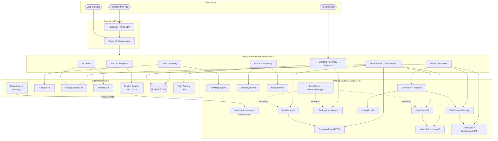
```mermaid
flowchart TD
    subgraph Clients["Client Layer"]
        FC([Farcaster Mini App])
        TG([Telegram Bot])
        WEB([Web Browser])
    end

    subgraph Frontend["Next.js 15 Frontend"]
        UI[React UI Components]
        SDK[Farcaster Frame SDK]
    end

    subgraph API["Next.js API Layer (68 endpoints)"]
        AUTH[Auth & Delegation]
        MUSIC_API[Music / Radio / Subscription]
        EPK_API[EPK / Booking]
        DAO_API[DAO / Dev Studio]
        CLIMB_API[Climbing / Events / Sponsors]
        ORACLE_API[AI Oracle]
        PASSPORT_API[Passport / Itinerary]
    end

    subgraph External["External Services"]
        PIMLICO[Pimlico Bundler<br/>ERC-4337]
        PINATA[Pinata IPFS]
        GEMINI[Google Gemini AI]
        NEYNAR[Neynar API]
        ENVIO[Envio Indexer<br/>GraphQL]
        REDIS[(Upstash Redis)]
        PYTH[Pyth Entropy<br/>VRF]
    end

    subgraph Monad["Monad Mainnet (Chain 143)"]
        SAFE[Safe Smart Accounts]
        NFT[EmpowerToursNFTV2]
        RADIO[LiveRadioV3]
        SUB[MusicSubscriptionV5]
        PLAY[PlayOracleV3]
        EPKC[EPKRegistryV2]
        CLIMB[ClimbingLocationsV2]
        ITIN[ItineraryNFTV2]
        PASS[PassportNFT]
        TOURS[ToursToken + RewardManager]
        GOV[Governor + Timelock]
        VTOURS[VotingTOURS]
        FACTORY[DAOContractFactory]
        DEVS[DevStudio + DeploymentNFT]
    end

    FC --> SDK --> UI
    TG --> CLIMB_API
    WEB --> UI
    UI --> API

    AUTH --> PIMLICO --> SAFE
    MUSIC_API --> NFT & RADIO & SUB & PLAY
    EPK_API --> PINATA & EPKC
    DAO_API --> GEMINI & GOV & FACTORY & DEVS
    CLIMB_API --> CLIMB & PYTH
    ORACLE_API --> GEMINI & NEYNAR
    PASSPORT_API --> PASS & ITIN

    SAFE -->|Gasless txns| Monad
    ENVIO -->|Index events| Monad
    EPK_API --> REDIS
    MUSIC_API --> REDIS

    GOV --> VTOURS
    GOV --> FACTORY
    FACTORY --> DEVS
    PLAY --> SUB
    RADIO --> NFT
    TOURS -.->|Rewards| PLAY & RADIO & CLIMB
```

### Data Flow: User Action to On-Chain

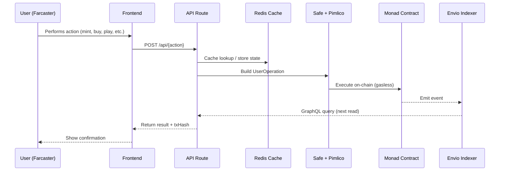
```mermaid
sequenceDiagram
    participant U as User (Farcaster)
    participant F as Frontend
    participant A as API Route
    participant R as Redis Cache
    participant S as Safe + Pimlico
    participant M as Monad Contract
    participant E as Envio Indexer

    U->>F: Performs action (mint, buy, play, etc.)
    F->>A: POST /api/{action}
    A->>R: Cache lookup / store state
    A->>S: Build UserOperation
    S->>M: Execute on-chain (gasless)
    M-->>E: Emit event
    E-->>A: GraphQL query (next read)
    A-->>F: Return result + txHash
    F-->>U: Show confirmation
```

### Smart Contract Dependency Map

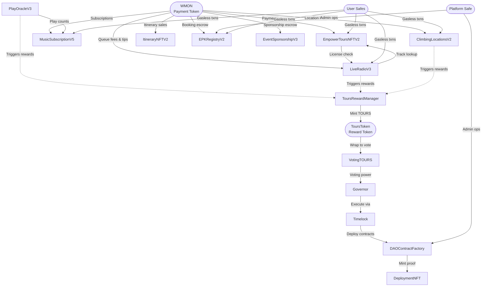
```mermaid
flowchart TD
    WMON([WMON<br/>Payment Token])
    TOURS([ToursToken<br/>Reward Token])

    WMON -->|Payments| NFT[EmpowerToursNFTV2]
    WMON -->|Queue fees & tips| RADIO[LiveRadioV3]
    WMON -->|Subscriptions| SUB[MusicSubscriptionV5]
    WMON -->|Location fees| CLIMB[ClimbingLocationsV2]
    WMON -->|Itinerary sales| ITIN[ItineraryNFTV2]
    WMON -->|Booking escrow| EPK[EPKRegistryV2]
    WMON -->|Sponsorship escrow| EVENTS[EventSponsorshipV3]

    TOURS -->|Wrap to vote| VTOURS[VotingTOURS]
    VTOURS -->|Voting power| GOV[Governor]
    GOV -->|Execute via| TIMELOCK[Timelock]
    TIMELOCK -->|Deploy contracts| FACTORY[DAOContractFactory]
    FACTORY -->|Mint proof| DEPLOY_NFT[DeploymentNFT]

    PLAY[PlayOracleV3] -->|Play counts| SUB
    RADIO -->|Track lookup| NFT
    NFT -->|License check| RADIO

    REWARD[ToursRewardManager] -->|Mint TOURS| TOURS
    PLAY -.->|Triggers rewards| REWARD
    RADIO -.->|Triggers rewards| REWARD
    CLIMB -.->|Triggers rewards| REWARD

    SAFE([Platform Safe]) -->|Admin ops| EPK
    SAFE -->|Admin ops| FACTORY
    USER_SAFE([User Safes]) -->|Gasless txns| NFT & RADIO & SUB & CLIMB & EPK
```

### Music License Purchase Flow

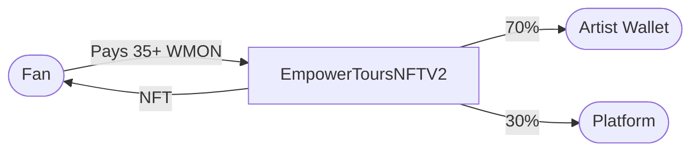
```mermaid
flowchart LR
    Fan([Fan]) -->|Pays 35+ WMON| Contract[EmpowerToursNFTV2]
    Contract -->|70%| Artist([Artist Wallet])
    Contract -->|30%| Platform([Platform])
    Contract -->|NFT| Fan
```

### Radio Queue & Payment Flow

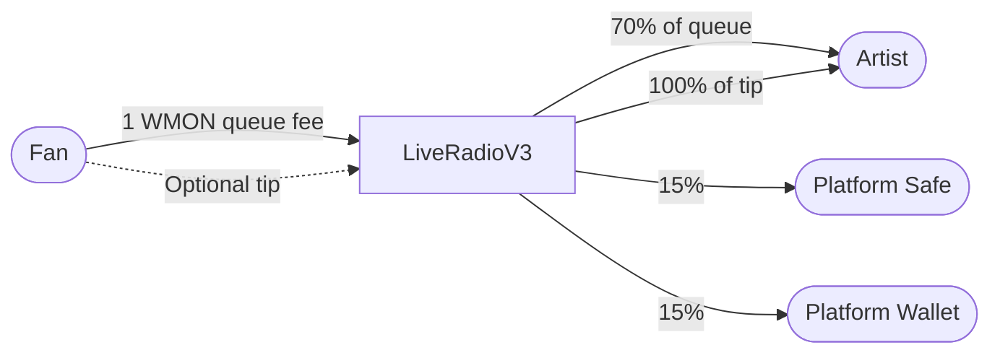
```mermaid
flowchart LR
    Fan([Fan]) -->|1 WMON queue fee| Radio[LiveRadioV3]
    Fan -.->|Optional tip| Radio
    Radio -->|70% of queue| Artist([Artist])
    Radio -->|15%| PlatformSafe([Platform Safe])
    Radio -->|15%| PlatformWallet([Platform Wallet])
    Radio -->|100% of tip| Artist
```

### Monthly Subscription Cycle

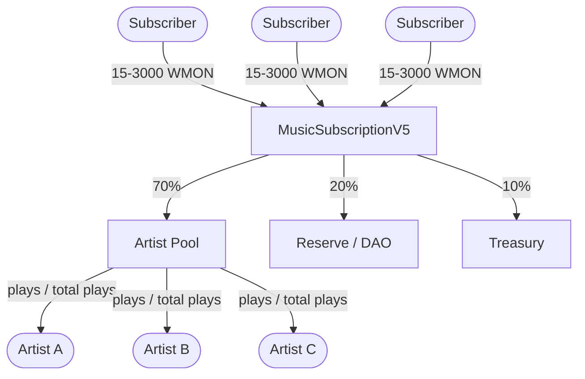
```mermaid
flowchart TD
    S1([Subscriber]) -->|15-3000 WMON| Pool[MusicSubscriptionV5]
    S2([Subscriber]) -->|15-3000 WMON| Pool
    S3([Subscriber]) -->|15-3000 WMON| Pool
    Pool -->|70%| ArtistPool[Artist Pool]
    Pool -->|20%| Reserve[Reserve / DAO]
    Pool -->|10%| Treasury[Treasury]
    ArtistPool -->|plays / total plays| A1([Artist A])
    ArtistPool -->|plays / total plays| A2([Artist B])
    ArtistPool -->|plays / total plays| A3([Artist C])
```

### Play Recording Pipeline

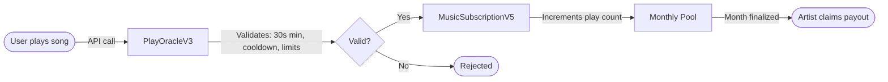
```mermaid
flowchart LR
    User([User plays song]) -->|API call| Oracle[PlayOracleV3]
    Oracle -->|Validates: 30s min, cooldown, limits| Check{Valid?}
    Check -->|Yes| Record[MusicSubscriptionV5]
    Check -->|No| Reject([Rejected])
    Record -->|Increments play count| MonthPool[Monthly Pool]
    MonthPool -->|Month finalized| Distribute([Artist claims payout])
```

### Gasless Delegation Flow

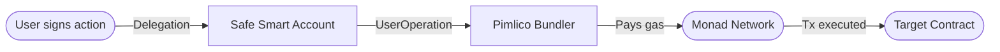
```mermaid
flowchart LR
    User([User signs action]) -->|Delegation| Safe[Safe Smart Account]
    Safe -->|UserOperation| Bundler[Pimlico Bundler]
    Bundler -->|Pays gas| Monad([Monad Network])
    Monad -->|Tx executed| Contract([Target Contract])
```

### EPK AI Generation Flow

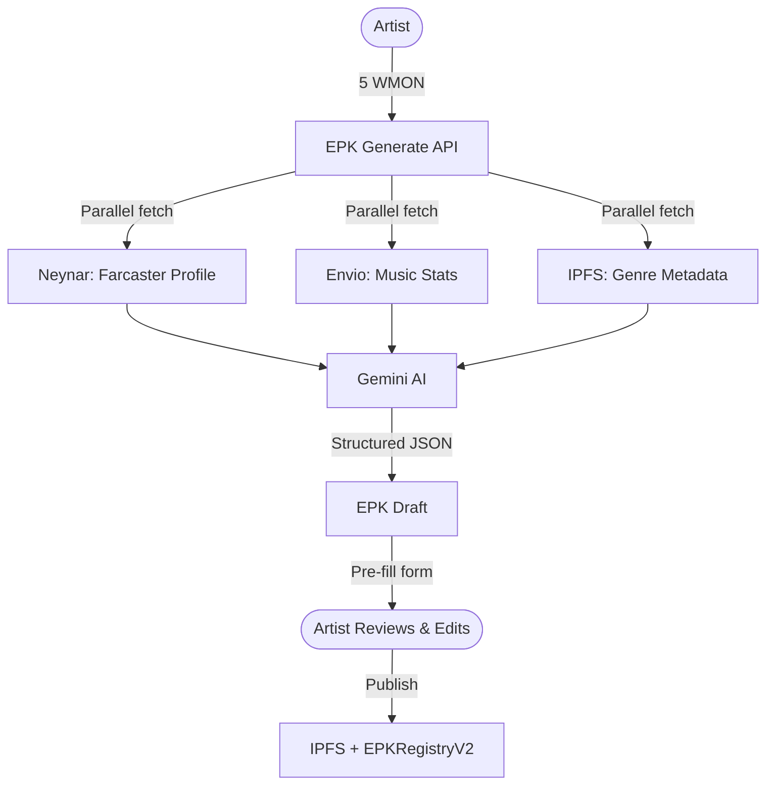
```mermaid
flowchart TD
    Artist([Artist]) -->|"5 WMON"| API[EPK Generate API]
    API -->|"Parallel fetch"| Neynar[Neynar: Farcaster Profile]
    API -->|"Parallel fetch"| Envio[Envio: Music Stats]
    API -->|"Parallel fetch"| IPFS_Meta[IPFS: Genre Metadata]
    Neynar --> Gemini[Gemini AI]
    Envio --> Gemini
    IPFS_Meta --> Gemini
    Gemini -->|"Structured JSON"| Draft[EPK Draft]
    Draft -->|"Pre-fill form"| Review([Artist Reviews & Edits])
    Review -->|"Publish"| IPFS[IPFS + EPKRegistryV2]
```

### EPK Booking Escrow Flow

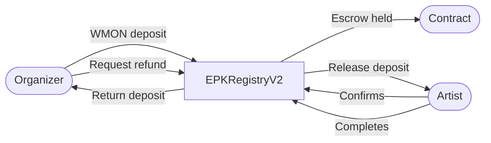
```mermaid
flowchart LR
    Organizer([Organizer]) -->|WMON deposit| EPK[EPKRegistryV2]
    EPK -->|Escrow held| Contract([Contract])
    Artist([Artist]) -->|Confirms| EPK
    Artist -->|Completes| EPK
    EPK -->|Release deposit| Artist
    Organizer -->|Request refund| EPK
    EPK -->|Return deposit| Organizer
```

### Dev Studio Pipeline

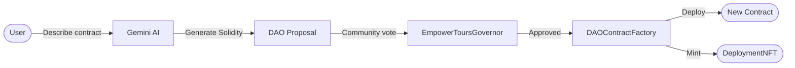
```mermaid
flowchart LR
    User([User]) -->|Describe contract| AI[Gemini AI]
    AI -->|Generate Solidity| Proposal[DAO Proposal]
    Proposal -->|Community vote| Governor[EmpowerToursGovernor]
    Governor -->|Approved| Factory[DAOContractFactory]
    Factory -->|Deploy| Contract([New Contract])
    Factory -->|Mint| NFT([DeploymentNFT])
```

### TOURS Reward System

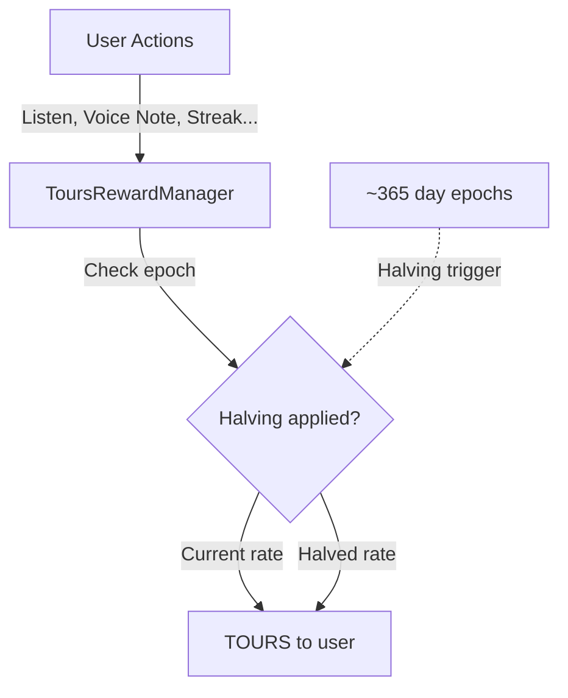
```mermaid
flowchart TD
    Actions[User Actions] -->|Listen, Voice Note, Streak...| Manager[ToursRewardManager]
    Manager -->|Check epoch| Halving{Halving applied?}
    Halving -->|Current rate| Mint[TOURS to user]
    Halving -->|Halved rate| Mint
    Schedule[~365 day epochs] -.->|Halving trigger| Halving
```

---

## Deployed Contracts (V3)

All contracts are deployed on **Monad Mainnet** and verifiable on MonadScan.

> Some entries below (DAO governance, DevStudio, DAOContractFactory, ClimbingLocationsV2) are
> still deployed and functional on-chain, but their app UI was removed in the July 2026 music
> pivot. They are listed for completeness, not as maintained surfaces.

| Contract | Address | Purpose |
|----------|---------|---------|
| EmpowerToursNFTV2 | [`0xB9B3acf33439360B55d12429301E946f34f3B73F`](https://monadscan.com/address/0xB9B3acf33439360B55d12429301E946f34f3B73F) | Music license NFT sales. Artist receives **90%**, treasury 10% (`treasuryFee() = 10`, verified on-chain) — paid direct to the artist in the same transaction. Licences run 30 days (`licensePeriod() = 2592000`). |
| LiveRadioV3 | [`0x042EDF80713e6822a891e4e8a0800c332B8200fd`](https://monadscan.com/address/0x042EDF80713e6822a891e4e8a0800c332B8200fd) | Decentralized radio queue, tips, voice notes |
| MusicSubscriptionV5 | [`0x5372aD0291a69c1EBc0BE2dc6DE9dab224045f19`](https://monadscan.com/address/0x5372aD0291a69c1EBc0BE2dc6DE9dab224045f19) | Subscription pool with monthly artist payouts |
| PlayOracleV3 | [`0xe210b31bBDf8B28B28c07D45E9b4FC886aafDCEf`](https://monadscan.com/address/0xe210b31bBDf8B28B28c07D45E9b4FC886aafDCEf) | On-chain play tracking and anti-spam |
| ItineraryNFTV2 | [`0x97529316356A5bcAd81D85E9a0eF941958c4b020`](https://monadscan.com/address/0x97529316356A5bcAd81D85E9a0eF941958c4b020) | Travel itinerary NFT marketplace |
| ClimbingLocationsV2 | [`0x23e45acc278B5c9D1ECc374b39b7d313E781CBc3`](https://monadscan.com/address/0x23e45acc278B5c9D1ECc374b39b7d313E781CBc3) | Climbing location database with dual-NFT system |
| ToursRewardManagerV2 | [`0x056452a44d81AB502e24510b2e4FB1789C6faf85`](https://monadscan.com/address/0x056452a44d81AB502e24510b2e4FB1789C6faf85) | TOURS reward distribution with halving + venue operator rewards |
| VenueRegistry | [`0x73264a3570e35dAed1Adc2ec83A502E2517a43B5`](https://monadscan.com/address/0x73264a3570e35dAed1Adc2ec83A502E2517a43B5) | Venue registration, commit-reveal playlists, batch play submission, TOURS mining |
| ToursTokenV2 (TOURS) | [`0x45b76a127167fD7FC7Ed264ad490144300eCfcBF`](https://monadscan.com/address/0x45b76a127167fD7FC7Ed264ad490144300eCfcBF) | ERC-20 platform reward token. This is the address the app uses. `0xf61F2b01…f74f` is the superseded V1 "EmpowerTours Token". |
| WMON | [`0x3bd359C1119dA7Da1D913D1C4D2B7c461115433A`](https://monadscan.com/address/0x3bd359C1119dA7Da1D913D1C4D2B7c461115433A) | Wrapped Monad (payment token) |
| EmpowerTours Passport V3 | [`0x93126e59004692B01961BE505aa04F55d5bd1851`](https://monadscan.com/address/0x93126e59004692B01961BE505aa04F55d5bd1851) | Travel passport NFTs (195 countries) |
| EPKRegistryV2 | [`0x232D2fF45459e9890ABA3a95e5E0c73Fe85D621D`](https://monadscan.com/address/0x232D2fF45459e9890ABA3a95e5E0c73Fe85D621D) | Electronic Press Kit registry + WMON escrow booking |
| VotingTOURS | [`0xe5377b1f90b9a70dd7b0f6ea34f9c3d287b3c44c`](https://monadscan.com/address/0xe5377b1f90b9a70dd7b0f6ea34f9c3d287b3c44c) | vTOURS governance voting token |
| EmpowerToursGovernor | [`0x4d05fb8c2d090769a084aa0138ccf7a549452fa3`](https://monadscan.com/address/0x4d05fb8c2d090769a084aa0138ccf7a549452fa3) | DAO governance (proposals, voting, execution) |
| EmpowerToursTimelock | [`0x4f7f9111215f2270a92bd64e4c1e9d7de516bd79`](https://monadscan.com/address/0x4f7f9111215f2270a92bd64e4c1e9d7de516bd79) | Timelock controller for governance execution |
| DAOContractFactory | [`0x627a2c457e5Eb3E9C4B6632Ac69f8c39228D7968`](https://monadscan.com/address/0x627a2c457e5Eb3E9C4B6632Ac69f8c39228D7968) | DAO-governed smart contract deployment pipeline |
| DeploymentNFT | [`0xfA002C7538B6e28Dd7dDd00F1d3A46Ea0731A586`](https://monadscan.com/address/0xfA002C7538B6e28Dd7dDd00F1d3A46Ea0731A586) | Provenance NFTs for deployed contracts |
| EmpowerToursDevStudio | [`0xEC27aD035c39DE7217A3F4DAe64a7a67a477d880`](https://monadscan.com/address/0xEC27aD035c39DE7217A3F4DAe64a7a67a477d880) | AI contract generation credit system + whitelist |
| Platform Safe | [`0xf3b9D123E7Ac8C36FC9B5AB32135c665956725bA`](https://monadscan.com/address/0xf3b9D123E7Ac8C36FC9B5AB32135c665956725bA) | Treasury & platform operations |

### Companion Services

| Service | Purpose |
|---------|---------|
| [EmpowerTours Bot](https://t.me/AI_RobotExpert_bot) | Telegram bot for rock climbing & TOURS rewards |
| [Envio Indexer](./empowertours-envio/) | GraphQL event indexing for all contracts |

---

## Tech Stack

| Layer | Technology |
|-------|-----------|
| Frontend | Next.js 15 (App Router), React 18, TypeScript, TailwindCSS |
| Platform | Farcaster Mini App SDK |
| Smart Contracts | Solidity, Foundry, OpenZeppelin (ERC-721, ERC-20, Governor) |
| Account Abstraction | Safe Protocol, Pimlico (ERC-4337 UserOp bundler) |
| Backend | Next.js API Routes (121 route files), Viem |
| Indexing | Envio (GraphQL event indexing) |
| Storage | IPFS (Pinata), Upstash Redis |
| AI | Google Gemini (Oracle, collector art, EPK generation) |
| Randomness | Pyth Entropy |
| APIs | Neynar (Farcaster), IPInfo (Geolocation), Google Maps |

---

## Project Structure

```
fcempowertours/
├── app/
│   ├── api/                    # 74 API route directories (121 route files)
│   │   ├── execute-delegated/  # Gasless delegated transactions (core)
│   │   ├── oracle/             # AI Oracle (Gemini)
│   │   ├── live-radio/         # Radio streaming
│   │   ├── events/             # Event management
│   │   ├── sponsorship/        # Event sponsorship
│   │   ├── music/              # Music catalog
│   │   ├── epk/                # Electronic Press Kit (create, generate, seed, lookup, booking, PDF)
│   │   ├── mint-passport/      # Passport minting
│   │   ├── mint-music/         # Music NFT minting
│   │   ├── record-play/        # Play tracking
│   │   └── ...
│   ├── components/
│   │   └── oracle/             # UI components
│   │       ├── CreateNFTModal.tsx     # NFT minting (4 types incl. collector editions)
│   │       ├── LiveRadioModal.tsx
│   │       ├── MusicPlaylist.tsx
│   │       ├── MusicSubscriptionModal.tsx
│   │       ├── PassportMintModal.tsx
│   │       ├── EPKModal.tsx           # Multi-step EPK creation wizard
│   │       ├── EventOracle.tsx
│   │       └── ...
│   ├── epk/                    # Public EPK pages (/epk/[slug])
│   ├── experiences/            # Experience pages
│   ├── oracle/                 # AI Oracle page
│   ├── dashboard/              # User dashboard
│   └── ...                     # 35 page routes
├── contracts/                  # Solidity smart contracts
│   ├── LiveRadioV3.sol
│   ├── MusicSubscriptionV5.sol
│   ├── PlayOracleV3.sol
│   ├── ClimbingLocationsV2.sol
│   ├── ItineraryNFTV2.sol
│   ├── ToursRewardManager.sol
│   ├── EmpowerToursNFTV3.sol
│   ├── PassportNFTV3.sol
│   ├── ToursTokenV2.sol
│   ├── VotingTOURS.sol
│   ├── EmpowerToursGovernor.sol
│   ├── EPKRegistry.sol           # EPKRegistryV2 - EPK + WMON escrow booking
│   └── ...
├── empowertours-envio/         # Envio indexer config
├── lib/
│   └── ...                      # Shared utilities & ABIs
├── docs/                       # GitHub Pages site
│   └── index.html
└── public/                     # Static assets
```

---

## Getting Started

### Prerequisites
- Node.js 18+
- npm
- Foundry (for smart contracts)

### Installation

```bash
git clone https://github.com/empowertours/fcempowertours.git
cd fcempowertours
npm install
```

### Environment Variables

Create a `.env.local` file with the required environment variables. See `.env.example` or contact the team.

### Development

```bash
npm run dev
```

Access the app at http://localhost:3000

### Build

```bash
npm run build
```

### Smart Contract Development

```bash
forge build
forge test
```

---

## Deployment

Deployed on **Railway** with automatic builds from GitHub.

```bash
railway login
railway link
railway up
```

### Contracts

The deploy scripts take their signer **from the command line**, never from a key
in the environment. `vm.startBroadcast()` is called with no argument, so forge
supplies it:

```bash
# encrypted keystore, passphrase typed at the prompt
forge script script/DeployV3.s.sol --account <name> --rpc-url monad --broadcast

# or a hardware wallet, where the key never leaves the device
forge script script/DeployV3.s.sol --ledger --rpc-url monad --broadcast
```

Nothing reads a private key from `.env`. `tools/verify-deploy-signer-from-cli.ts`
fails the build if a script goes back to reading one.

The deployer ADDRESS is still needed before broadcasting, for governance
defaults and logging, and comes from `vm.envOr("DEPLOYER_ADDRESS", msg.sender)`
— a public address is safe in `.env`.

Contract verification needs `ETHERSCAN_API_KEY` in the environment, or set
directly in `contracts/foundry.toml`, which is gitignored. It is used only by
`--verify` and cannot sign anything.

---

## Links

- **Live App:** [fcempowertours-production-6551.up.railway.app](https://fcempowertours-production-6551.up.railway.app)
- **Farcaster Mini App:** [farcaster.xyz/miniapps/83hgtZau7TNB/empowertours](https://farcaster.xyz/miniapps/83hgtZau7TNB/empowertours)
- **Telegram Bot:** [t.me/AI_RobotExpert_bot](https://t.me/AI_RobotExpert_bot)
- **Portfolio:** [empowertours.xyz](https://empowertours.xyz)
- **X:** [@EmpowerTours](https://x.com/EmpowerTours)

---

**Built on Monad | Farcaster Mini App**
