# EmpowerTours Component State Machines

This document contains state machine diagrams for all major components in the EmpowerTours application.

---

## 1. DailyAccessGate

Multi-requirement onboarding gate with 5 daily access checks.

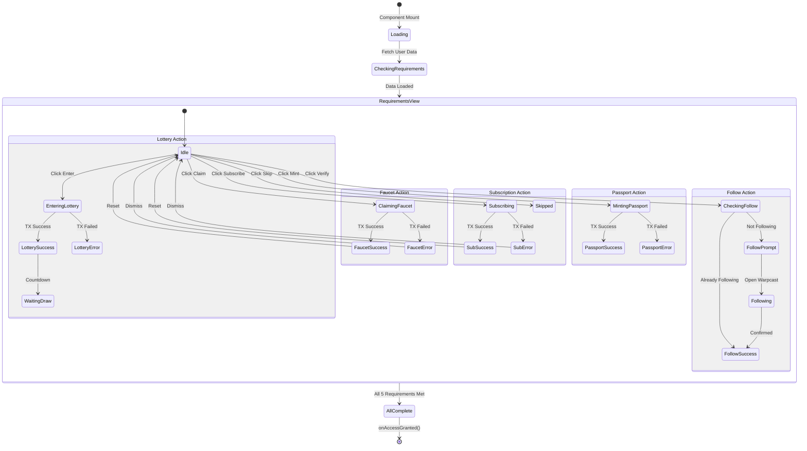

**States:**
- `Loading` - Initial data fetch
- `Idle` - Ready for user action
- `activeAction` states: `'faucet'`, `'subscription'`, `'follow'`, `'passport'`, `'lottery'`
- `Success/Error` - Per-action feedback

---

## 2. MirrorMate (Tour Guide Matching)

Tinder-style guide matching with hold-to-match gesture.

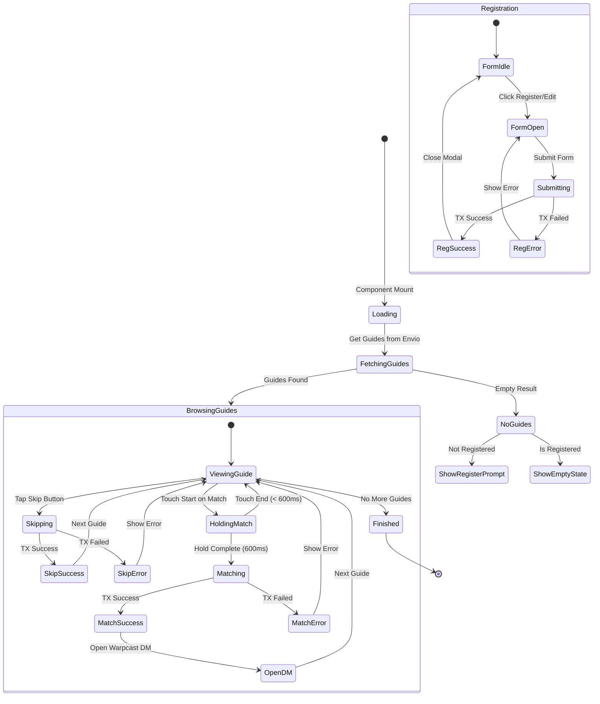

**Transaction States (`txState`):**
- `'idle'` - Ready for action
- `'loading'` - Transaction in progress
- `'success'` - Transaction confirmed
- `'error'` - Transaction failed

**Gesture States:**
- `isHolding: boolean` - Touch/mouse down on match button
- `holdProgress: 0-100` - Visual progress ring fill

---

## 3. CreateNFTModal (Music/Art NFT Minting)

4-step NFT creation wizard with file upload and audio trimming.

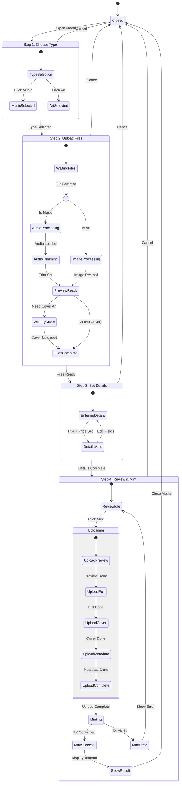

**Step States (`currentStep`):**
- `1` - Type selection (music vs art)
- `2` - File upload + audio trimming
- `3` - Title, price, details
- `4` - Review and mint

**Upload Progress (`progressStage`):**
- `'preview'` → `'full'` → `'cover'` → `'metadata'` → `'complete'`

---

## 4. PassportRequirement

3-step passport minting requirement flow.

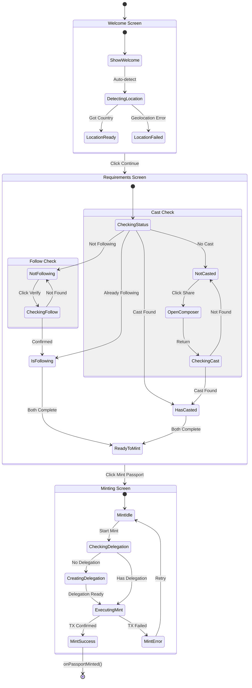

**Step States (`currentStep`):**
- `'welcome'` - Introduction with country detection
- `'requirements'` - Follow + Cast verification
- `'minting'` - Transaction execution

---

## 5. FarcasterAppSetup

2-step Farcaster mini-app integration wizard.

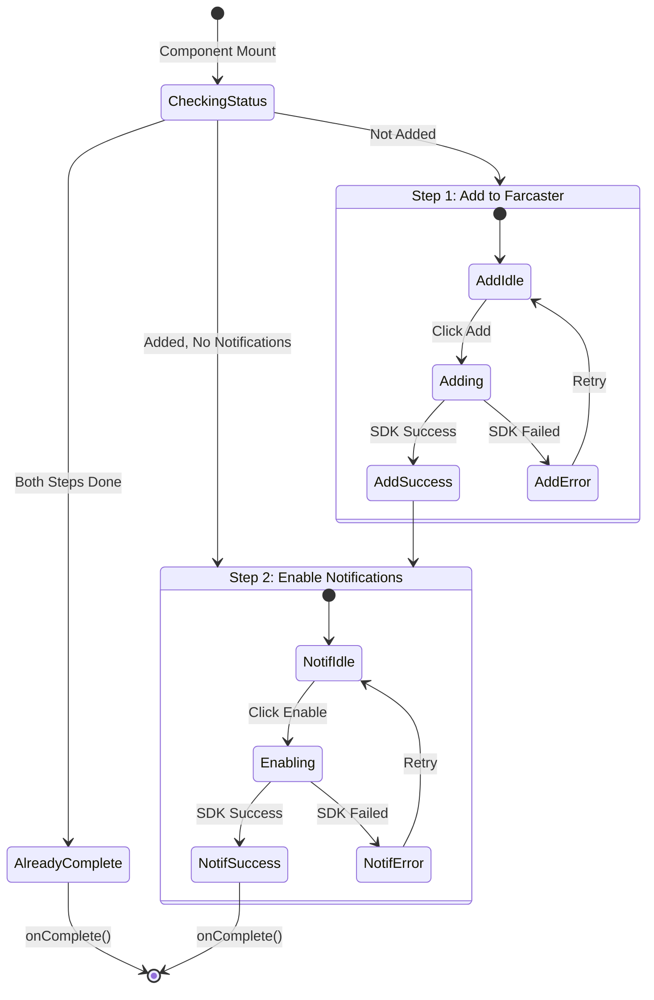

**Boolean States:**
- `isAdded` - App added to Farcaster
- `notificationsEnabled` - Push notifications enabled

---

## 6. PassportStakingModal

MON staking with yield tracking and position management.

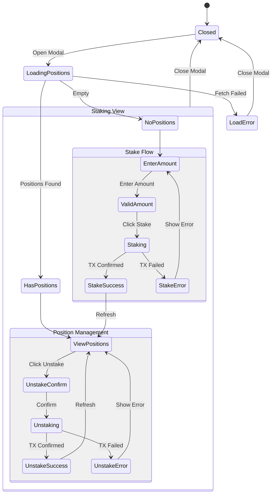

**Transaction States:**
- `isStaking: boolean` - Stake transaction in progress
- `isUnstaking: string | null` - Position ID being unstaked

---

## 7. LiveRadioPlayer

Real-time radio streaming with queue management.

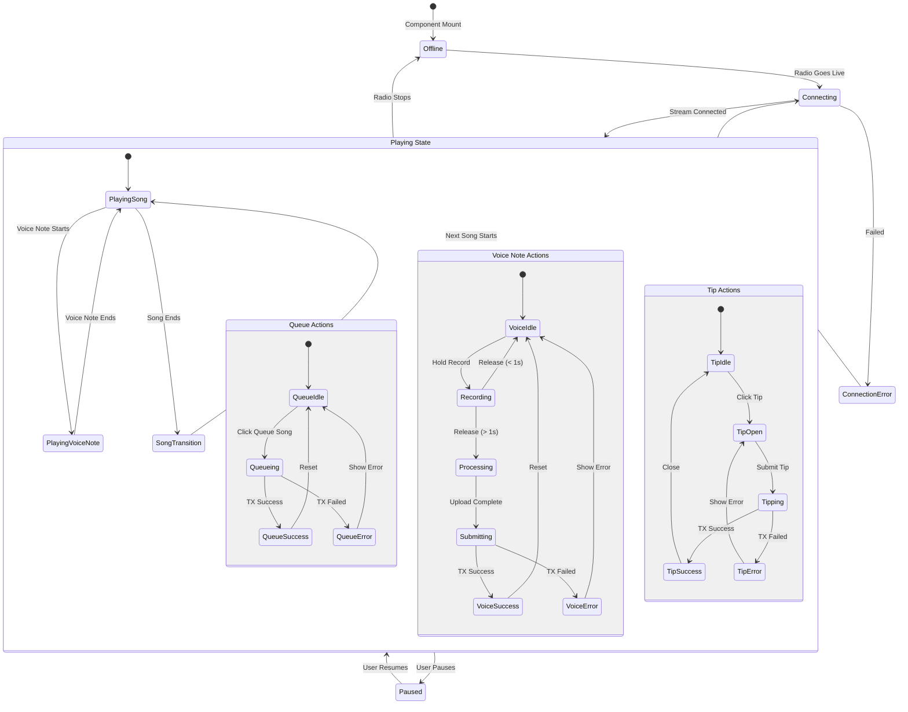

**Playback States:**
- `currentSong` - Currently playing track metadata
- `currentVoiceNote` - Currently playing voice note
- `playbackPhase` - `'song'` | `'voice_note'`
- `isLive` - Radio broadcast status

---

## 8. EnvioDashboard

Live statistics dashboard with periodic polling.

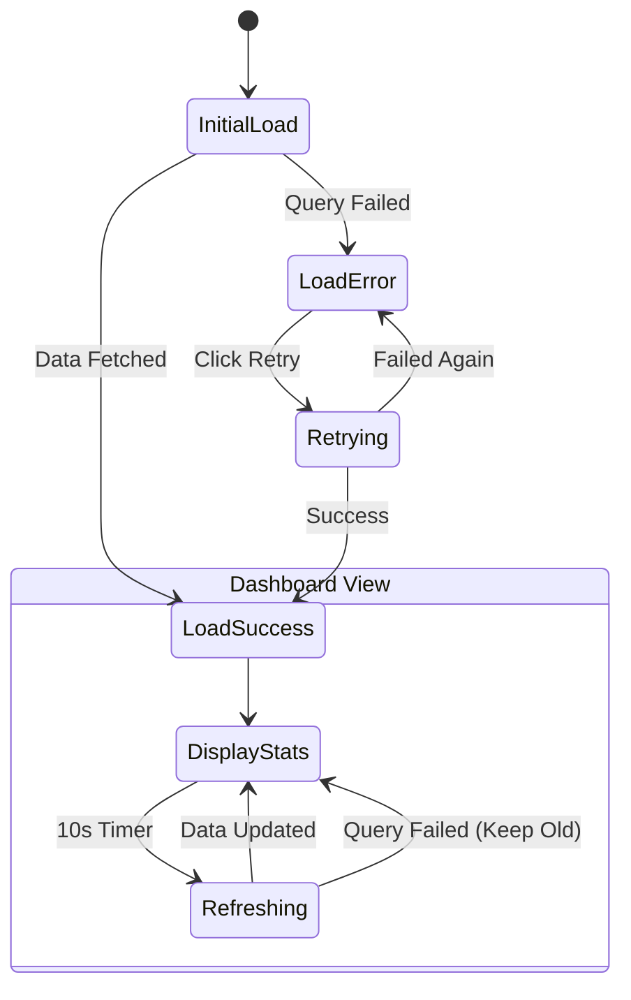

**Polling States:**
- `loading` - Initial or refresh loading
- `stats` - Cached statistics object
- `error` - Error message (null when ok)

---

## 9. UserSafeWidget

Safe wallet balance indicator with clipboard functionality.

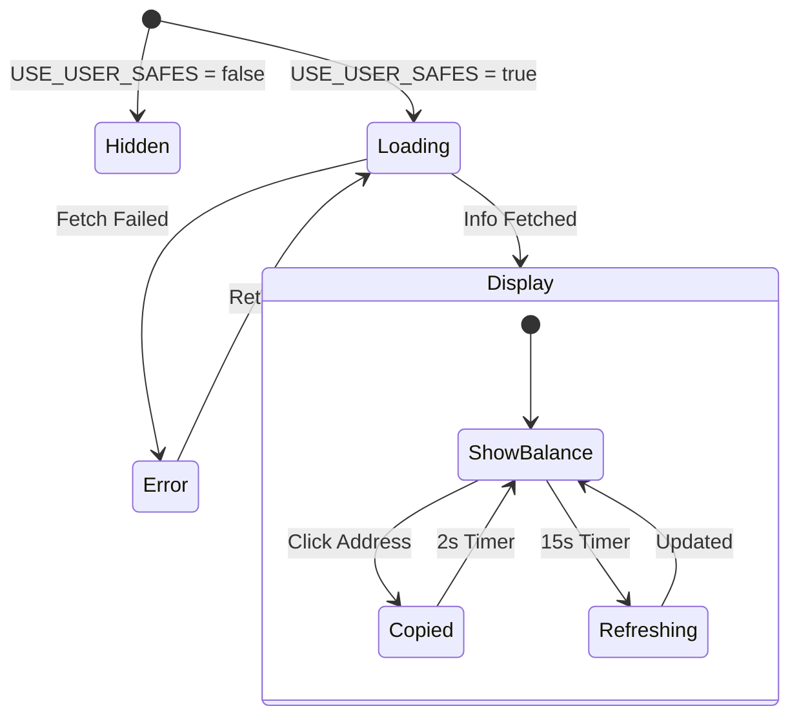

**Visual States (based on balance):**
- Red badge: Balance = 0
- Yellow badge: Balance < 0.01 MON
- Green badge: Balance >= 0.01 MON

---

## 10. SwipeNavigation

Mobile gesture navigation wrapper.

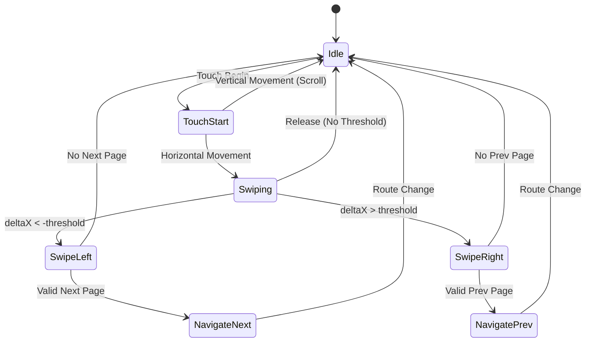

**Gesture States:**
- `swipeProgress: 0-1` - Distance traveled
- `swipeDirection: 'left' | 'right' | null` - Current direction

---

## 11. Transaction State Pattern (Common)

Used across multiple components for blockchain operations.

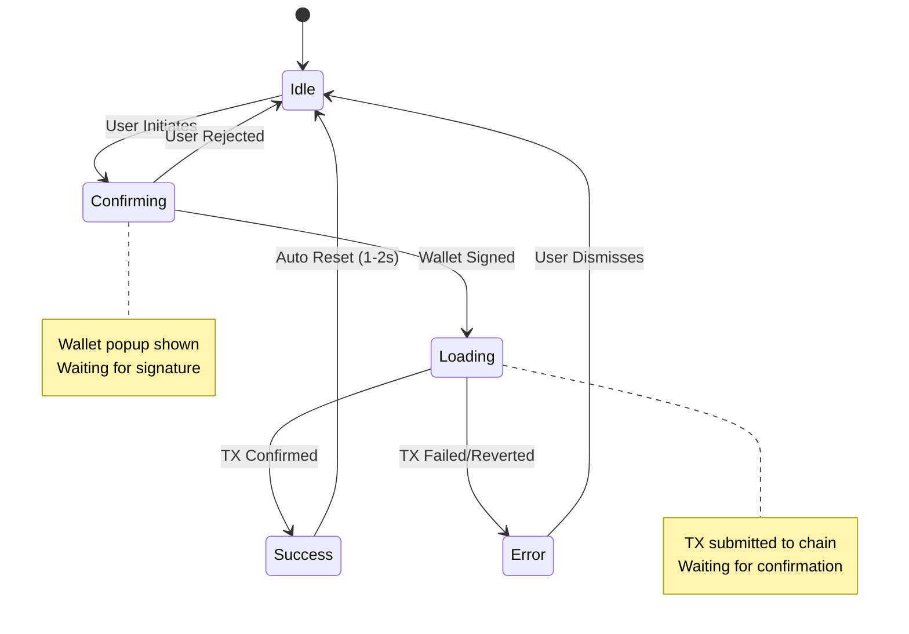

**Common `txState` Values:**
- `'idle'` - Ready for new action
- `'confirming'` - Waiting for wallet signature
- `'loading'` - Transaction pending
- `'success'` - Transaction confirmed
- `'error'` - Transaction failed

---

## 12. Multi-Step Wizard Pattern (Common)

Used for complex flows like NFT creation, passport minting.

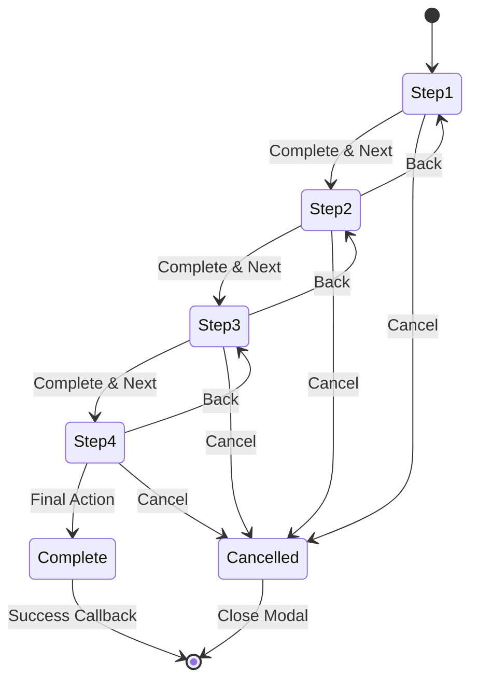

**Step Progression:**
- `currentStep: number` - 1, 2, 3, 4...
- Each step validates before allowing progression
- Back navigation preserves entered data

---

## Summary

| Component | Primary Pattern | States Count | Async Operations |
|-----------|----------------|--------------|------------------|
| DailyAccessGate | Multi-requirement checklist | 5 requirement states + actions | 5 parallel checks |
| MirrorMate | Swipe matching + gestures | 4 tx states + gesture | Skip, Match, Register |
| CreateNFTModal | 4-step wizard | 4 steps + upload stages | Upload, Mint |
| PassportRequirement | 3-step wizard | 3 steps + 2 checks | Follow, Cast, Mint |
| FarcasterAppSetup | 2-step wizard | 2 boolean states | SDK calls |
| PassportStakingModal | Position management | Load + Stake + Unstake | Stake, Unstake |
| LiveRadioPlayer | Streaming + queue | Playback + 3 action types | Queue, Voice, Tip |
| EnvioDashboard | Polling display | Load + Display + Refresh | GraphQL polling |
| UserSafeWidget | Balance display | Load + Display | API polling |
| SwipeNavigation | Gesture tracking | Swipe direction + progress | None (client-side) |
